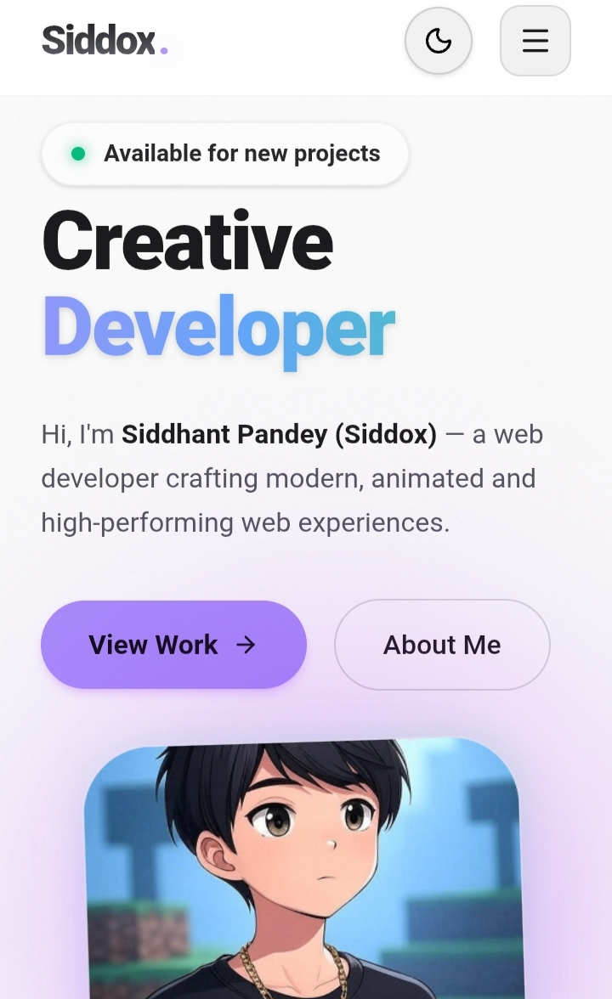
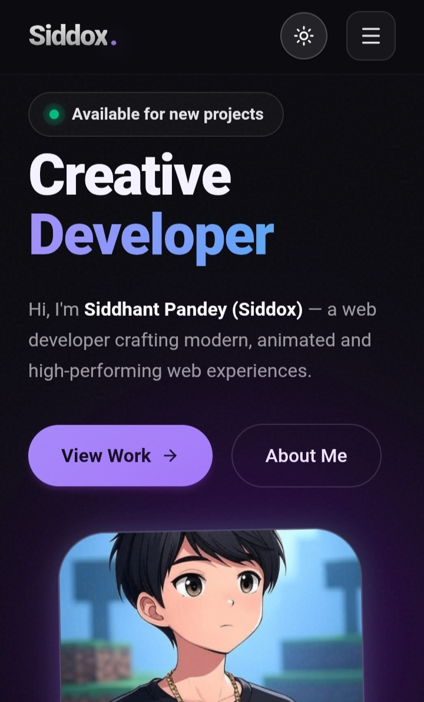

🌐 Siddox — Personal Portfolio

Welcome to the official repository of my personal portfolio website! 🚀

This website represents my journey, skills, projects, and work in web development and technology.

🔗 Live Website

  
  &nbsp;
  

  ☀️ <b>Light Theme</b> &nbsp;&nbsp;&nbsp;&nbsp;&nbsp;&nbsp; 🌙 <b>Dark Theme</b>

  <b>👆 Click either preview to visit the live website!</b>

  <a href="https://siddox.netlify.app">🌍 Visit siddox.netlify.app</a>

---

✨ About

Siddox is my personal portfolio website, created to showcase who I am, what I do, and the projects I build.

The website brings together my work, skills, interests, and digital presence in one place.

---

🚀 Features

- 🎨 Clean and modern user interface
- 🌙 Dark and Light theme support
- 📱 Responsive design
- 💻 Project showcase
- 👤 About section
- 🛠️ Skills and technology showcase
- 📬 Contact and social links
- ⚡ Fast and accessible web experience

---

🛠️ Built With

This portfolio website was built using modern web technologies.

- React ⚛️

---

🖼️ Portfolio Preview

  
  

  <i>Click on a preview to explore the live website.</i>

---

🌍 Live Demo

🚀 Explore the website here:

"🌐 siddox.netlify.app" (https://siddox.netlify.app)

---

📌 Getting Started

If you want to run this project locally:

1. Clone the repository

git clone https://github.com/SiddhantGOAT/Siddox.git

2. Open the project

Open the project folder in your preferred code editor.

3. Run the website

✨ Run the command in your terminal :
  npm run dev

---

📱 Responsive Design

The website is designed to provide a smooth experience across different devices, including:

- 💻 Desktop
- 📱 Mobile
- 📟 Tablet

---

🤝 Connect With Me

Feel free to explore my portfolio and connect with me through the links available on my website.

🌐 Website: "siddox.netlify.app" (https://siddox.netlify.app)

---

⭐ If you like this project, consider giving the repository a star!

Made with ❤️ by Siddox

